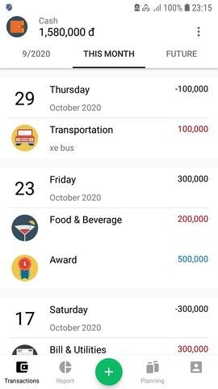
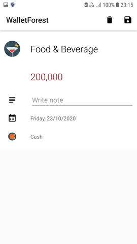
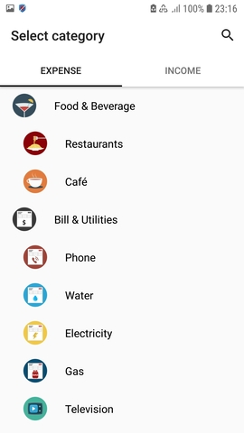
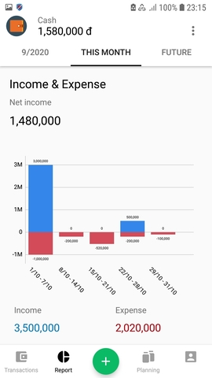
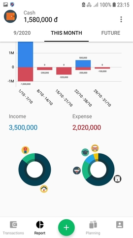
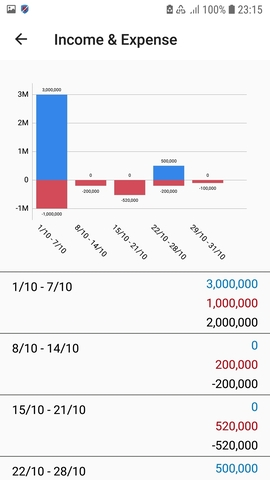
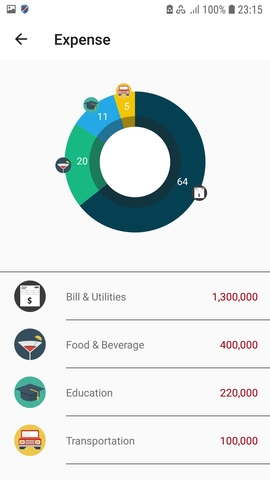
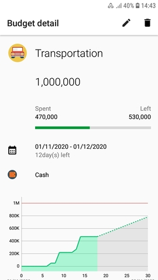

# AndroidKotlin
My personal projects.
# WalletForest
A personal finance management app.
- Track transactions by months, weeks, years,....
- View report for each range and for categories.
- Budgets for spending habits.

Using:
- Architecture: MVVM
- Android architecture components: LiveData, ViewModel, Room
- Kotlin coroutines, Kotlin Flow
- Database: Sqlite with Room

&nbsp;&nbsp;&nbsp;&nbsp;
&nbsp;&nbsp;&nbsp;&nbsp;
&nbsp;&nbsp;&nbsp;&nbsp;
&nbsp;&nbsp;&nbsp;&nbsp;
&nbsp;&nbsp;&nbsp;&nbsp;
